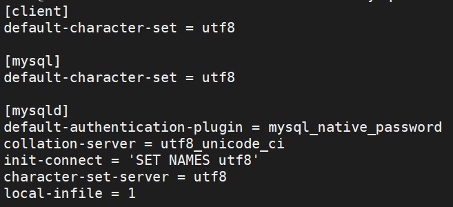
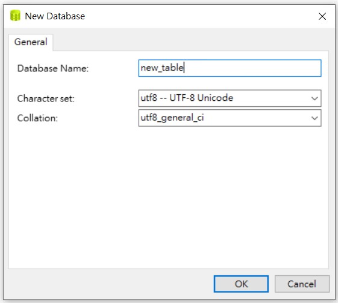
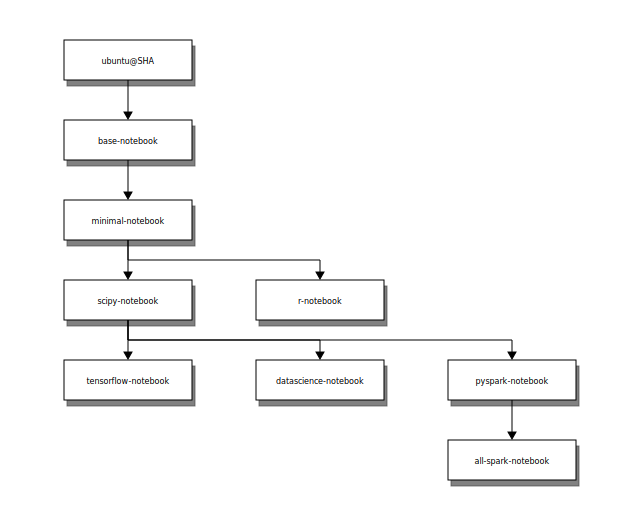

# DockerHub resource

- 下載 images-01
  - OS system
    - ubuntu
    - centos
  - website
    - thenetworkchuck/nccoffee:frenchpress，8081
    - DockerCon2020 sample = littlefish0331/hello-world，8080
    - Gitbook: 4001, 4002
    - Grafana: 3000
- 下載 images-02Database
  - mysql: 3306
  - Postgress
  - MSSQL: 1433
  - mariadb: 3307
  - BigObject: 3308, 9090, 9091
  - ElasticSearch: 9200, 9300
- 下載 images-03code: R, Python, Julia
  - R+Rstudio(+python2+python3): 8787, 3838(shiny)
  - Python+jupyter notebook/lab: 8888, 9999
  - jupyter notebook mini/r/scipy: 8801, 8802, 8803
  - R+Python+Julia+jupyter notebook/lab: 8800, 9900
  - [【Docker】建立 Jupyter Container. 這邊使用jupyter/datascience-notebook(https:/… | by JiHung Lin | Medium](https://medium.com/@jihung.mycena/docker-%E5%BB%BA%E7%AB%8B-jupyter-container-8084748e2f33)
  
---

## 下載 images-01

- ubuntu
- centos
- thenetworkchuck/nccoffee:frenchpress
- 下載 DockerCon 範例

### OS system

- [ubuntu - Docker Hub](https://hub.docker.com/_/ubuntu)

```{bash}
docker pull ubuntu
```

- [centos - Docker Hub](https://hub.docker.com/_/centos)

```{bash}
docker pull centos
```

--

### website

**thenetworkchuck/nccoffee sample:**

- [thenetworkchuck/nccoffee - Docker Hub](https://hub.docker.com/r/thenetworkchuck/nccoffee)

```{bash}
// -t, --tty  Allocate a pseudo-TTY。分配偽TTY。
docker run -d -t -p 8081:80 --name nccoffee thenetworkchuck/nccoffee:frenchpress
```

**DockerCon sample:**

- [下載 DockerCon 範例](https://hub.docker.com/repository/docker/littlefish0331/hello-world)

```{bash}
docker pull littlefish0331/hello-world
docker run -p 8080:80 --name DockerCon2020 -d littlefish0331/hello-world
```

**Gitbook:**

- google key word: build a gitbook on docker
- [fellah/gitbook - Docker Hub](https://hub.docker.com/r/fellah/gitbook/): 有在更新。可以參考Dockerfile。
- [yanqd0/gitbook - Docker Hub](https://hub.docker.com/r/yanqd0/gitbook/): 很久沒更新，inspire by fellah/gitbook。
- [10,000小時的修煉之路: 【Docker】Ubuntu / gitbook](http://webcache.googleusercontent.com/search?q=cache:3yNCZ36iXKQJ:maxdev.huder.link/2016/02/dockerubuntu-gitbook.html+&cd=10&hl=zh-TW&ct=clnk&gl=tw): 教學在 ubuntu 上建立環境，架設 Gitbook。環境需要 `apt-get install nodejs, npm, nodejs-legacy`，接著可開始安裝 gitbook。

```{bash}
docker pull fellah/gitbook

// 記得先建立好連動資料夾，並把權限開啟。
docker run --name FAE_no72_gitbook -v /datamount/Gitbook/FAE_no72:/srv/gitbook -p 4001:4000 -d fellah/gitbook
```

**Grafana:**

- [grafana/grafana - Docker Hub](https://hub.docker.com/r/grafana/grafana)
- [New Docker Install with persistent storage, Permission problem - Support - Grafana Community](https://community.grafana.com/t/new-docker-install-with-persistent-storage-permission-problem/10896/3)

```{bash}
docker pull grafana/grafana
docker run --name=grafana -v /datamount/grafana:/var/lib/grafana -p 3000:3000 -d grafana/grafana

// 家目錄的位置不太一樣
cd /usr/share/grafana/
```

---

## 下載 images-02Database

### MSSQL: SQL SERVER

- [Microsoft SQL Server - Docker Hub](https://hub.docker.com/_/microsoft-mssql-server)
- [KingKong Bruce記事: 一次就愛上MS SQL Server for Linux](https://blog.kkbruce.net/2017/12/ms-sql-server-for-linux.html#.XylSRCgzaUk)
- [在 Docker 下建立並使用 MSSQL Server for Linux | Titangene Blog](https://titangene.github.io/article/docker-mssql-server-for-linux.html)

**啟動 container:**

> - ACCEPT_EULA: 需同意授權合約。
> - MSSQL_SA_PASSWORD: 需要是強式密碼並至少 8 個字元。強式密碼需包含：大寫、小寫、數字，符號四者。
> - -p hostPort:containerPort
> - --name: 指定 container 名稱
> - -d: 背景執行
> - -v: (Volume 技術)建立實體資料夾與 container 資料夾的對應關係。

```{bash}
// 建議是先把連動的實體資料夾開好，並把該資料夾的使用者以及群組設定好
// 再執行下面指令
sudo mkdir mssql
chmod 775 mssql (或是 chmod 777 mssql)
```

```{bash}
// ACCEPT_EULA=Y。confirms your acceptance of the End-User Licensing Agreement.
// userid = 'sa'
// MSSQL_PID，可以選擇 MSSQL 的版本。
// SA_PASSWORD=<your_strong_password>
docker run --name mssql \
-e "ACCEPT_EULA=Y" \
-e "SA_PASSWORD=P@ssw0rd" \
-v /datamount/mssql:/var/opt/mssql \
-p 1433:1433 \
-d mcr.microsoft.com/mssql/server:2019-latest

//一行指令
docker run -e "ACCEPT_EULA=Y" -e "SA_PASSWORD=MSSQL@2020" -v /datamount/mssql:/var/opt/mssql -p 1433:1433 --name mssql -d mcr.microsoft.com/mssql/server:2019-latest
```

**進入 container，並查看 SA 密碼:**

```{bash}
docker exec -it mssql bash
echo $SA_PASSWORD
```

**變更密碼:**

> -S：server
> -U：user name
> -P：password
> -Q：query，執行 SQL 指令後結束 sqlcmd

```{bash}
docker exec -it mssql /opt/mssql-tools/bin/sqlcmd \
  -S localhost -U SA -P '<YourStrong!Passw0rd>' \
  -Q 'ALTER LOGIN SA WITH PASSWORD="<YourNewStrong!Passw0rd>"'

// 其實也可以再 container 裡面登入 SA 之後，再改密碼。
// 退出 MSSQL 使用 `quit`。
docker exec -it mssql bash
/opt/mssql-tools/bin/sqlcmd -S localhost -U SA -P 'MSSQL@2020'
ALTER LOGIN SA WITH PASSWORD="<YourNewStrong!Passw0rd>"
quit
```

**備份資料庫:**

```{bash}
docker exec -it mssql /opt/mssql-tools/bin/sqlcmd -S localhost -U SA \
-Q "BACKUP DATABASE <DBname e.g. testDB> TO DISK = N'/var/opt/mssql/data/testdb.bak' WITH NOFORMAT, NOINIT, NAME = 'demodb-full', SKIP, NOREWIND, NOUNLOAD, STATS = 10"
```

**還原資料庫:**

```{bash}
docker exec -it mssql /opt/mssql-tools/bin/sqlcmd -S localhost -U SA \
-Q "RESTORE DATABASE <DBname e.g. testDB> FROM DISK = N'/var/opt/mssql/data/testdb.bak' WITH  FILE = 1, NOUNLOAD, REPLACE, STATS = 5"
```

--

### mariadb

- [mariadb - Docker Hub](https://hub.docker.com/_/mariadb)
- [Change MySQL default character set to UTF-8 in my.cnf? - Stack Overflow](https://stackoverflow.com/questions/3513773/change-mysql-default-character-set-to-utf-8-in-my-cnf)

**啟動 container:**

```{bash}
docker run --name some-mariadb \
-e MYSQL_ROOT_PASSWORD=mariaDB@2020 \
-v /datamount/mariadb/data:/var/lib/mysql \
-v /datamount/mariadb/conf.d:/etc/mysql/conf.d \
-p 3307:3306 \
-d mariadb

docker run --name some-mariadb -e MYSQL_ROOT_PASSWORD=mariaDB@2020 -v /datamount/mariadb/data:/var/lib/mysql -v /datamount/mariadb/conf.d:/etc/mysql/conf.d -p 3307:3306 -d mariadb
```

#### mariadb編碼

**進入 container、mariaDB:**

```{bash}
docker exec -it some-mariadb bash
mysql -u root -p

  > show databases;
  > exit
```

**查看 mariaDB 的 character-set-server 和 collation-server:**

```{bash}
docker exec -it some-mariadb bash
mysql -u root -p

  > SELECT @@character_set_database, @@collation_database;
  > SELECT DEFAULT_CHARACTER_SET_NAME, DEFAULT_COLLATION_NAME FROM INFORMATION_SCHEMA.SCHEMATA; //另一種作法
  >
  > show variables like 'char%';
  > show variables like 'collation%';
  > exit
```

**修改 Configuration file 與結果:**

即連動資料夾下，新增 my.cnf，修改裡面內容。  
修改之後要重啟 container。

```{mysql}
[client]
default-character-set=utf8

[mysql]
default-character-set=utf8


[mysqld]
collation-server = utf8_unicode_ci
init-connect='SET NAMES utf8'
character-set-server = utf8
```

  
  
  

--

### 下載 MySQL

- [mysql - Docker Hub](https://hub.docker.com/_/mysql?tab=description)
- 連動的資料夾會自動建立。  

```{bash}
docker run --name some-mysql \
--env MYSQL_ROOT_PASSWORD=MYSQL@2020 \
-v /datamount/mysql/data:/var/lib/mysql \
-v /datamount/mysql/conf:/etc/mysql/conf.d \
-p 3306:3306 \
--detach mysql:latest

//一行指令
docker run --name some-mysql --env MYSQL_ROOT_PASSWORD=MYSQL@2020 -v /datamount/mysql/data:/var/lib/mysql -v /datamount/mysql/conf:/etc/mysql/conf.d -p 3306:3306 --detach mysql:latest
```

#### 密碼無法登入的問題

這主要是因為 Mysql 版本的問題。密碼加密的方式不同。

- [MySQL 8.0 的新密碼加密 plugin 導致 PHP 連線失敗 - Zeroplex 生活隨筆](https://blog.zeroplex.tw/2019/07/mysql-80-plugin-php.html)
- [連線 MySQL 8.0 時，加密方式不相容的解決方法 | IT人](https://iter01.com/443370.html)
- [Andreas Geisler - Berlin based Full Stack Software Developer](http://www.andreasgeisler.com/blog/fatal-error-uncaught-pdoexception-the-server-requested-authentication-method-unknown-to-the-client-caching_sha2_password/2018/11/)
- [Upgrading to MySQL 8.0 : Default Authentication Plugin Considerations | MySQL Server Blog](https://mysqlserverteam.com/upgrading-to-mysql-8-0-default-authentication-plugin-considerations/)
- [MySQL密碼不能登錄的解決辦法 - 每日頭條](https://kknews.cc/zh-tw/code/b2jromj.html)

**docker run:**

到連動資料夾 /datamount/mysql/conf 底下，建立 my.cnf，
在 my.cnf 加上下列資訊，然後重啟 container。  

```{my.cnf}
[mysqld]
default-authentication-plugin = mysql_native_password
```

```{bash}
docker restart some-mysql
```

這樣就可以在 VM 上面，用輸入密碼的方式進入 mysql。
但如果想要在外面用密碼方式登入還需要進入 mysql 做設定。

```{bash}
docker exec -it some-mysql bash
mysql -u root -p
```

```{mysql}
// 看一下 password 的加密方式。
use mysql;
SELECT user, authentication_string, host from user;

// 設定可以用 mysql_native_password 加密方式登入。
// ALTER USER 'root'@'localhost' IDENTIFIED WITH mysql_native_password BY 'MYSQL@2020';
ALTER USER 'root'@'%' IDENTIFIED WITH mysql_native_password BY 'MYSQL@2020';
FLUSH PRIVILEGES;
```

**docker-compose:**

或是修改 docker-compose.yml 的 mysql 服務部分，新增一行。(這方法我還沒嘗試過，但應該可行。)

```{docker compose .yml}
command: --default-authentication-plugin=mysql_native_password
```

> 以下是舊的做法，依舊可用，指示步驟比較多一點。
>  
> **Step01:**
>
> 去 /DBdata/mysql/conf 新增 my.cnf。  
> 新增與修改檔案要用 sudo su 權限。  
>
>
> ```{my.cnf}
> [mysqld]
> skip-grant-tables
> ```
>
> ```{bash}
> docker restart some-mysql
> ```
>
> **Step02:**
>
> 登入 container  
> 登入 mysql，密碼 DAS@mysql2020
>
> ```{bash}
> docker exec -it some-mysql bash
> mysql -u root -p
> ```
>
> **Step03:**
>
> 指定使用資料庫，更新密碼為空。
>
> ```{bash}
> use mysql;
> SELECT user, authentication_string, host from user;
> update user set authentication_string='' where user='root';
> flush privileges;
> ```
>
> **Step04:**
>
> 退出mysql，把第一步的skip-grant-tables註釋。再重啟mysql
>
> ```{bash}
> vim my.cnf
> docker restart some-mysql
> docker exec -it some-mysql bash
> mysql -u root -p
> ```
>
> **Step05:**
>
> 使用原始加密的密碼 + 權限設定
>
> mysql_native_password
>
> ```{bash}
> use mysql;
> ALTER USER 'root'@'localhost' IDENTIFIED WITH mysql_native_password BY 'DAS@mysql2020';
> ALTER USER 'root'@'%' IDENTIFIED WITH mysql_native_password BY 'DAS@mysql2020';
> GRANT ALL PRIVILEGES ON *.* TO 'root'@'localhost' WITH GRANT OPTION;
> ```

#### 看一些變數值

- [查詢 MySQL 對 此帳號 開放(GRANT)哪些權限 | Tsung's Blog](https://blog.longwin.com.tw/2009/06/query-mysql-show-grant-permission-2009/)
- [查詢 MySQL/MariaDB 資料庫的使用者帳號教學 - Office 指南](https://officeguide.cc/how-to-show-list-users-in-a-mysql-mariadb-database/)
- [mysql 查詢 user 帳號及權限 @ Js 片段記憶回顧中心 :: 痞客邦 ::](https://jason0324.pixnet.net/blog/post/42795331-mysql-%E6%9F%A5%E8%A9%A2-user-%E5%B8%B3%E8%99%9F%E5%8F%8A%E6%AC%8A%E9%99%90)

```{bash}
SHOW VARIABLES LIKE 'lower%';

use mysql;
select user, authentication_string, host from user;

// 查有哪些帳號
SELECT User, Host FROM mysql.user;

// 查帳號權限
// SHOW GRANTS FOR <username>;
SHOW GRANTS FOR root;
```

#### 建立新用戶

但是我還不太會給予權限。

```{bash}
CREATE USER 'kvgh'@'%' IDENTIFIED WITH mysql_native_password BY 'kvgh@DB2020';

/// 應該是這個，但是這權限有點太大。
// GRANT ALL PRIVILEGES ON *.* TO 'newuser'@'localhost';
GRANT ALL PRIVILEGES ON *.* TO 'kvgh'@'%';
```

#### 設定 local file 可以上傳

- [MySQL: Enable LOAD DATA LOCAL INFILE - Stack Overflow](https://stackoverflow.com/questions/10762239/mysql-enable-load-data-local-infile)

這樣就可以從程式端上傳資料，也可以用 LOAD 指令上傳local檔案。

```{bash}
SHOW GLOBAL VARIABLES LIKE 'local_infile';
SET GLOBAL local_infile = 1;
// 等價。SET GLOBAL local_infile = 'ON';
// 等價。SET GLOBAL local_infile = true;
```

但是這個設定，經過重啟會失效，所以必須在 my.cnf 中加入指令。

```{my.cnf}
[mysqld]
SET GLOBAL local_infile = 1
```

#### mysql編碼

**進入 container、mysql:**

```{bash}
docker exec -it some-mysql bash
mysql -u root -p

  > show databases;
  > exit
```

**查看 mysql 的 character-set-server 和 collation-server:**

```{bash}
docker exec -it some-mysql bash
mysql -u root -p

  > SELECT @@character_set_database, @@collation_database;
  > SELECT DEFAULT_CHARACTER_SET_NAME, DEFAULT_COLLATION_NAME FROM INFORMATION_SCHEMA.SCHEMATA; //另一種作法
  >
  > show variables like 'char%';
  > show variables like 'collation%';
  > exit
```

**修改 Configuration file 與結果:**

即連動資料夾下，新增 my.cnf，修改裡面內容。  
修改之後要重啟 container。

- mysqld 是服務端程序 = 作為 MYSQL Server 的操作指令。
- mysql是命令行客户端程序 = 作為 MYSQL Client 的操作指令

```{my.cnf}
[client]
default-character-set=utf8

[mysql]
default-character-set=utf8

[mysqld]
collation-server = utf8_unicode_ci
init-connect='SET NAMES utf8'
character-set-server = utf8
```







**總結 mysql 的 my.cnf:**

```{my.cnf}
[client]
default-character-set = utf8

[mysql]
default-character-set = utf8

[mysqld]
default-authentication-plugin = mysql_native_password
collation-server = utf8_unicode_ci
init-connect = 'SET NAMES utf8'
character-set-server = utf8
local-infile = 1
```

#### BigObject

- [bigobject/bigobject - Docker Hub](https://hub.docker.com/r/bigobject/bigobject)
- [BigObject Documentation](https://docs.bigobject.io/)

```{bash}
docker pull bigobject/bigobject

docker run --name bigobject -p 9090:9090 -p 9091:9091 -p 3306:3306 -v /datamount/bigobject/ds:/srv/bo/ds  -v /datamount/bigobject/file:/srv/bo/file -d bigobject/bigobject
```

#### ElasticSearch

- [elasticsearch - Docker Hub](https://hub.docker.com/_/elasticsearch)
- [Install Elasticsearch with Docker | Elasticsearch Reference [7.8] | Elastic](https://www.elastic.co/guide/en/elasticsearch/reference/current/docker.html#docker)
- [docker-tutorial/elasticsearch.md at master · jaywcjlove/docker-tutorial](https://github.com/jaywcjlove/docker-tutorial/blob/master/docker/elasticsearch.md)
- [After installing, elasticsearch will not start due to no logging configuration? · Issue #58 · elastic/ansible-elasticsearch](https://github.com/elastic/ansible-elasticsearch/issues/58)

```{bash}
// ES 在 docker 上面沒有 latest tag。
docker pull elasticsearch:7.8.1

// elasticsearch 的 image 沒有做很好，所以在連動資料夾上，會有權限問題。
// 解決方法就是先見一個沒有連動的，進去把要連度的資料夾權限打開(可以順便看一下該資料夾的擁有者與權限)。
// 再 commit 一個新的 image，之後用這個權限開啟的 image 去啟動 container。
docker run --name elasticsearch -e "discovery.type=single-node" -d elasticsearch:7.8.1
docker exec -it elasticsearch bash

  > chmod 777 data/ logs/ -R
  > exit

sudo su

  > mkdir data logs
  > chmod 777 data/ logs/ -R

docker commit elasticsearch elasticsearch:permissions_open
docker stop elasticsearch && docker rm elasticsearch

// 依照新建的 image 建立 container
docker run --name elasticsearch -e "discovery.type=single-node" -v /datamount/elasticsearch/data:/usr/share/elasticsearch/data -v /datamount/elasticsearch/logs:/usr/share/elasticsearch/logs -p 9200:9200 -p 9300:9300 -d elasticsearch:permissions_open
```

**關於 port 用途與設定:** 9200, 9300

- [Elasticsearch port 9200 or 9300? - Elastic Stack / Elasticsearch - Discuss the Elastic Stack](https://discuss.elastic.co/t/elasticsearch-port-9200-or-9300/72080)
- [和 Elasticsearch 交互 | Elasticsearch: 权威指南 | Elastic](https://www.elastic.co/guide/cn/elasticsearch/guide/current/_talking_to_elasticsearch.html)

結論:

- 9200 is for REST. 所有其他語言可以使用 RESTful API 通過端口 9200 和 Elasticsearch 進行通信，可以用web客戶端訪問Elasticsearch。甚至可以使用 curl 命令來和 Elasticsearch 交互。所以 9200 作為 Http 協議，主要用於外部通訊。
- 9300 for nodes communication. 兩個 Java 客戶端都是通過 9300 端口並使用 Elasticsearch 的原生傳輸協議和集群交互。集群中的節點通過端口 9300 彼此通信。如果這個端口沒有打開，節點則將無法形成一個集群。所以 9300 作為 tcp 協議，jar 之間就是通過 tcp 協議通訊，ES集群之間是通過 9300 進行通訊。

---

## 下載 images-03code

### R+Rstudio

- [rocker/rstudio Tags - Docker Hub](https://hub.docker.com/r/rocker/rstudio/tags)

建議下載 tag 有 ubuntu 的版本。
因為有嘗試過 tag: 3.6.3，結果啟動 container 失敗。  

```{bash}
// 下載 tag: 3.6.3-ubuntu18.04
// 內部有 python2, python3
docker pull rocker/rstudio:3.6.3-ubuntu18.04

docker run --name rstudio_363ubuntu \
-e ROOT=TRUE \
-e PASSWORD=rstudio@2020 \
-e ADD=shiny \
-v /datamount/rstudio:/home/rstudio \
-p 3838:3838 -p 8787:8787 \
-d rocker/rstudio:3.6.3-ubuntu18.04

// 下載 tag: latest
docker pull rocker/rstudio

docker run --name rstudio_latest \
-e ROOT=TRUE \
-e PASSWORD=rstudio@2020 \
-e ADD=shiny \
-v /datamount/rstudio:/home/rstudio \
-p 3838:3838 -p 8787:8787 \
-d rocker/rstudio
```

**安裝R套件:**

目前套件可以直接安裝。  
如果以後遇到失敗的狀況，可以嘗試下列方法:

- install.packages(pkgs = "package_name", lib = "your_path)
- install.packages(pkgs = "package_name", lib = "your_path, dependencies = T)
- use terminal > R
- use terminal > sudo su > R

--

### Python+jupyter notebook/lab

- [jupyter/datascience-notebook Tags - Docker Hub](https://hub.docker.com/r/jupyter/datascience-notebook/tags?page=1&name=python)
- [Selecting an Image — docker-stacks latest documentation](https://jupyter-docker-stacks.readthedocs.io/en/latest/using/selecting.html#jupyter-datascience-notebook)
- [Docker Hub](https://hub.docker.com/layers/jupyter/scipy-notebook/dc9744740e12/images/sha256-9bc3ccb1e56f1ac030d4e71242b3dfc6f3b64e76b41d926dc88eb01303bcf3f9?context=explore)

稍微研究一下 notebook relation!!



> 如果抓 datascience 系列，會有R。
> scipy, minimal 系列的 tag 看不出版本，但都是基於 base 系列製作。
> 所以最後抓取 base 系列的 python-3.7.6。
>
> 但是研究一下文檔，其實 base 系列沒有支援 LaTeX 讓我覺得很不妙，
> 可是 minimal, scipy 系列就是沒有 python 版本的 tag。
> 不然建議還是裝 minimal, scipy 系列。
>
> 後來覺得不妙，只好去一一嘗試，發現這個也是 python3.7.6，jupyter/scipy-notebook:dc9744740e12。

```{bash}
// docker pull jupyter/base-notebook:python-3.7.6
// docker run --name notebook_base -v /datamount/notebook/base_work:/home/jovyan/work -p 8888:8888 -d jupyter/base-notebook:python-3.7.6
```

> - jupyter notebook password: notebook@base2020
>   - 只有 python3.7.6。
>   - 用 `apt list | wc -l` 檢查有102個套件。
>   - 用 `pip list | wc -l` 檢查有82個套件。
>   - 用 `pip freeze | wc -l` 檢查有76個套件。

```{bash}
docker pull jupyter/scipy-notebook:dc9744740e12
docker run --name notebook_python_nb -v /datamount/notebook/python_nb_work:/home/jovyan/work -p 8888:8888 -d jupyter/scipy-notebook:dc9744740e12
docker run --name notebook_python_lab -e JUPYTER_ENABLE_LAB=yes -v /datamount/notebook/python_lab_work:/home/jovyan/work -p 9999:8888 -d jupyter/scipy-notebook:dc9744740e12
```

- jupyter notebook password: notebook@python2020。(都是這個)
  - 只有 python3.7.6。
  - 用 `apt list | wc -l` 檢查有492個套件。
  - 用 `pip list | wc -l` 檢查有132個套件。
  - 用 `pip freeze | wc -l` 檢查有126個套件。

--

### jupyter minimal/r/scipy

- [jupyter/minimal-notebook - Docker Hub](https://hub.docker.com/r/jupyter/minimal-notebook)
- [Docker Hub](https://hub.docker.com/r/jupyter/r-notebook)
- [jupyter/scipy-notebook - Docker Hub](https://hub.docker.com/r/jupyter/scipy-notebook)

> freeze: Output installed packages in requirements format.
> list: List installed packages

- jupyter/minimal-notebook
  - docker run --name notebook_mini -v /datamount/notebook/mini_work:/home/jovyan/work -p 8801:8888 -d jupyter/minimal-notebook
  - 有 python3。
  - 用 `apt list | wc -l` 檢查有375個套件。
  - 用 `pip list | wc -l` 檢查有82個套件。
  - 用 `pip freeze | wc -l` 檢查有76個套件。
  - jupyter notebook password: notebook@mini2020

- jupyter/r-notebook
  - docker run --name notebook_r -v /datamount/notebook/r_work:/home/jovyan/work -p 8802:8888 -d jupyter/r-notebook
  - 有 python3、R。
  - 用 `apt list | wc -l` 檢查有403個套件。
  - 用 `pip list | wc -l` 檢查有82個套件。
  - 用 `pip freeze | wc -l` 檢查有76個套件。
  - 進入R檢查`installed.packages() %>% str`則有201個套件。
  - jupyter notebook password: notebook@r2020

- jupyter/scipy-notebook
  - docker run --name notebook_scipy -v /datamount/notebook/scipy_work:/home/jovyan/work -p 8803:8888 -d jupyter/scipy-notebook
  - 有 python3。
  - 用 `apt list | wc -l` 檢查有499個套件。
  - 用 `pip list | wc -l` 檢查有142個套件。
  - 用 `pip freeze | wc -l` 檢查有136個套件。
  - jupyter notebook password: notebook@scipy2020

--

### R+Python+Julia+jupyter notebook

- [jupyter's Profile - Docker Hub](https://hub.docker.com/u/jupyter)
- [Selecting an Image — docker-stacks latest documentation](https://jupyter-docker-stacks.readthedocs.io/en/latest/using/selecting.html#jupyter-datascience-notebook)
- [jupyter/docker-stacks: Ready-to-run Docker images containing Jupyter applications](https://github.com/jupyter/docker-stacks)

**啟動 container:**

```{bash}
// 以 jupyter/datascience-notebook 這個 images 為例。
// 其他 jupyter 帳號下的 images 應該都差不多，可以再研究一下。
docker pull jupyter/datascience-notebook

// 啟動 container
// port 8800: 使用 jupyter notebook
// port 9900: 使用 jupyter lab
docker run --name rpyju_ds_nb -v /datamount/rpyju/dsnb:/home/jovyan/work -p 8800:8888 -d jupyter/datascience-notebook
docker run --name rpyju_ds_lab -e JUPYTER_ENABLE_LAB=yes -v /datamount/rpyju/dslab:/home/jovyan/work -p 9900:8888 -d jupyter/datascience-notebook
```

**登入:**

- [Running a notebook server — Jupyter Notebook 6.1.1 documentation](https://jupyter-notebook.readthedocs.io/en/stable/public_server.html)

登入都需要 token，取得 token 的方式就是到 container 裡面呼叫。

```{bash}
docker exec -it rpyju_ds_lab bash
//docker exec -it rpyju_ds_nb bash

// 列出 token
jupyter notebook list

// 使用密碼登入。需要 restart container 才會生效。
jupyter notebook password

  > rpyju@lab2020
  > rpyju@nb2020
```


---

## END

jupyter notebook/lab，之後要學怎麼用在

- docker 指令中設定 token or password
- dockerfile 指令中設定 token or password
