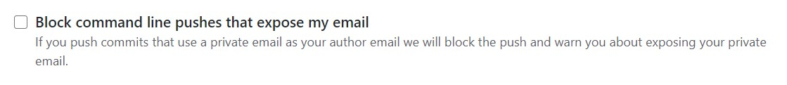

# README

記得 VM 剛啟動的時候，建議最好 `sudo reboot` 一下，之前的經驗是有一些檔案好像還處於 lock 狀態。  
跟著目錄(content)慢慢學習，大概可以一步步學習使用 TWCC 的資源。  
docker 的部分就十分建議看官方的 tutorial!!

**密碼不怕看，因為 port 我有鎖國網的網域!!**

<!-- TOC -->

- [README](#readme)
  - [gitbook設定](#gitbook設定)
  - [專案目標](#專案目標)
  - [END](#end)

<!-- /TOC -->

---

## gitbook設定

**結尾設定(end-of-line marker):**

- [git replacing LF with CRLF - Stack Overflow](https://stackoverflow.com/questions/1967370/git-replacing-lf-with-crlf)
- [Git Autocrlf 與 Safecrlf | ShunNien's Blog](https://shunnien.github.io/2018/06/03/git-autocrlf-and-safecrlf/)
- [解決斷行問題 · GIT教學](https://kingofamani.gitbooks.io/git-teach/content/chapter_5/crlf_problem.html)

因為 windows 開發環境和 Unix 開發環境，在文件結尾上有所不同。  
windows 是 CRLF，Unix 為 LF。

因此直接在 VM 上做 git clone 分支時，Gitbook 的呈現就產生問題。  
這邊需要對該專案進行 git config 的設定，  
設定完成後，在 windows 端使用 CRLF 直接上傳就行了。

```{git}
git config --local core.autocrlf false
```

**上傳設定:**

- [2019-01-06 Github 上傳錯誤， master (push declined due to email privacy restrictions - 簡書](https://www.jianshu.com/p/ae80af8f65e5)

要先去自己 Github 帳號的 E-mail settings，  
把「Block command line pushes that expose my email」這個選項取消掉!!



或是如參考資料提供的方法，去 E-mail settings > Keep my email addresses private，  
使用 Github 所提供的 Email。

---

## 專案目標

學習如何在VM上架設各種服務、應用程式、網路設定，  
以及如何讓不同服務之間溝通。最後打包成果與個體快照:

- Docker
  - run images
  - Dockerfile - docker compose - .yml
- VM
- program
  - python
  - R, Rstudio
  - JS、CSS、HTML
  - jupyter notebook
  - Julia
  - Grafana
- DB
  - Mysql
  - BigObject
  - SQL Server
  - MariaDB
  - Postgres
- API Server
  - Plumber
  - Flask
- Git
  - Gitbook
  - Gitlab
- FTP
  - FTP Client
  - FTP Server
- Web Service
  - Shiny

---

## END
