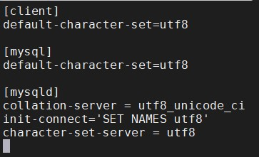
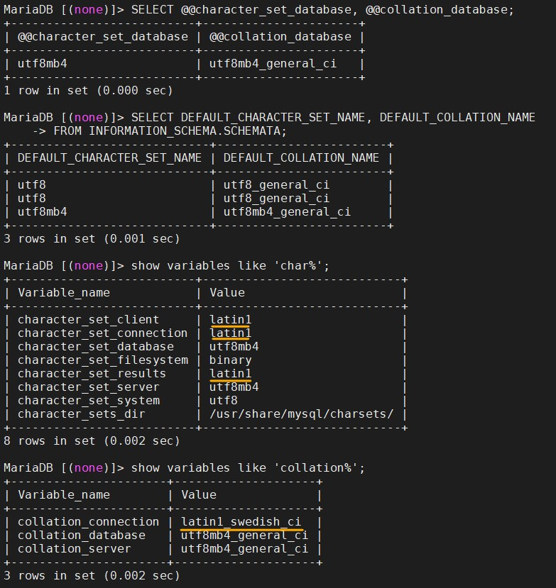
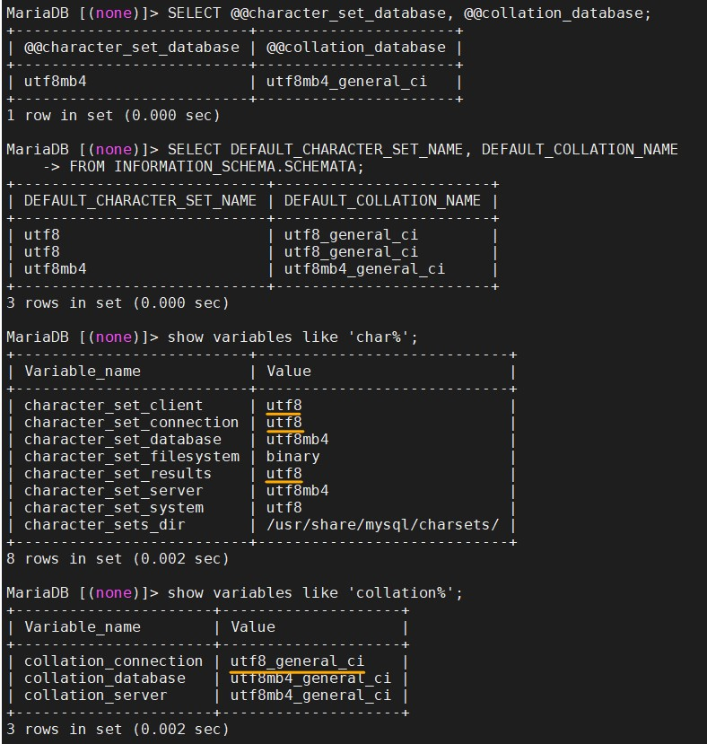
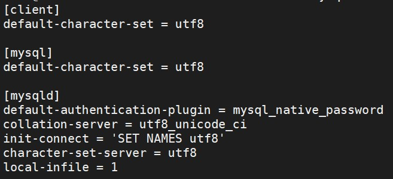
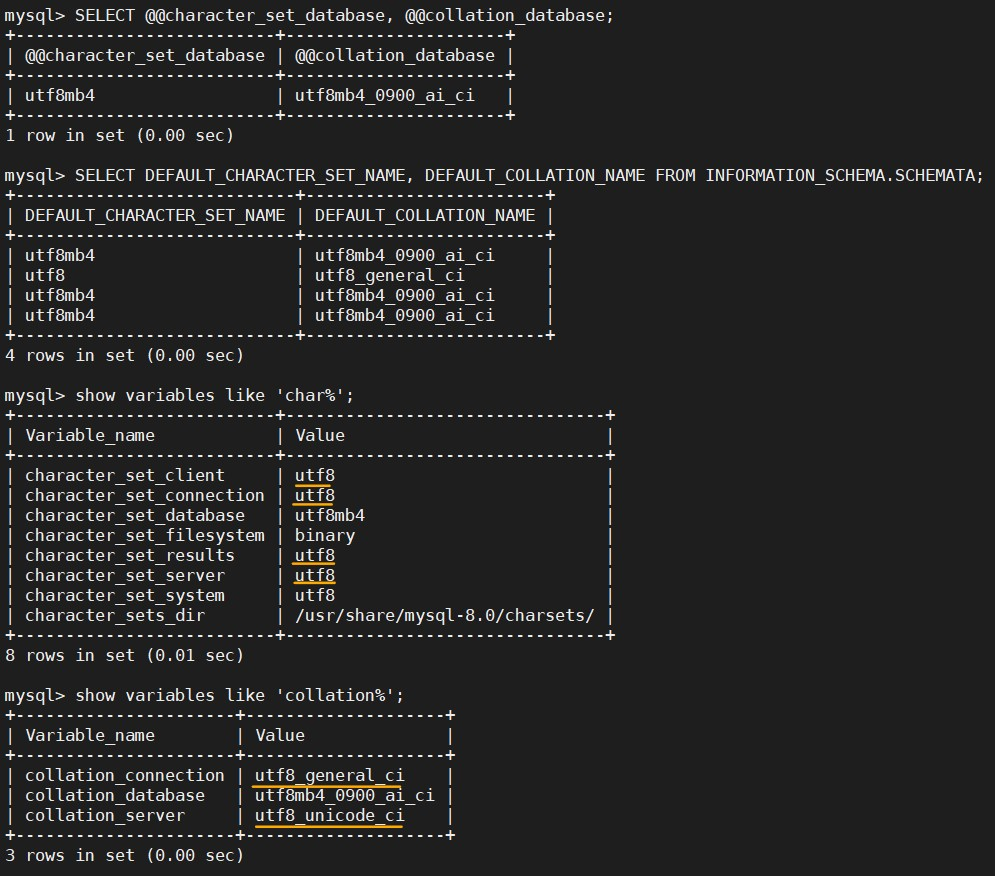
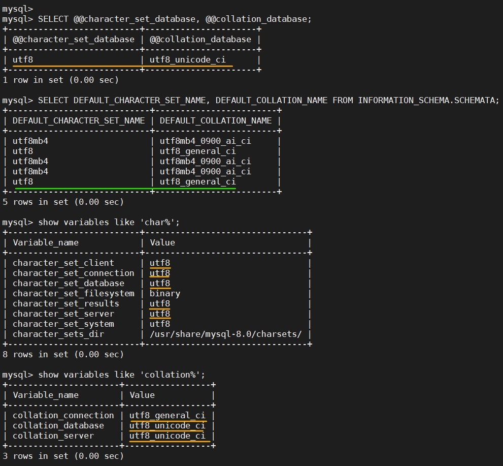

# Self Command History

<!-- X副對員工這麼壞= =，那公司的產品我還不用爆!  
把資源用到大爆炸的那一種XDD~   -->

這裡存放自己操作成功，並整理過後的指令(包括 bash 和 docker)。  
基本上照著做就可以到達同樣效果。  

簡單來說就是我的指令記事本啦XD~  
所以這邊都是從其他的 .md 檔複製過來之後，再做一點排版和補充。

<!-- TOC -->

- [Self Command History](#self-command-history)
  - [basic](#basic)
    - [歷史資訊清除](#歷史資訊清除)
    - [重開機](#重開機)
    - [已經安裝的套件](#已經安裝的套件)
    - [磁碟使用的初始狀況](#磁碟使用的初始狀況)
    - [權限](#權限)
    - [顯示目錄下-檔案-編碼-結尾換行符號](#顯示目錄下-檔案-編碼-結尾換行符號)
    - [su 最高權限者](#su-最高權限者)
    - [Others](#others)
    - [修改 ssh 登入](#修改-ssh-登入)
    - [TWCC-port connect](#twcc-port-connect)
  - [mount/umount Disk](#mountumount-disk)
    - [掛載狀況](#掛載狀況)
    - [格式化、掛載、卸除](#格式化掛載卸除)
    - [設定開機自動掛載](#設定開機自動掛載)
  - [Docker](#docker)
    - [下載與設定](#下載與設定)
    - [下載 images-01](#下載-images-01)
    - [下載 images-02Database](#下載-images-02database)
    - [下載 images-03code](#下載-images-03code)
  - [END](#end)

<!-- /TOC -->

---

## basic

### 歷史資訊清除

```{bash}
history -c
history -w
exit
history
```

--

### 重開機

```{bash}
sudo reboot
```

--

### 已經安裝的套件

```{bash}
//列出可安裝的套件(，並計算個數)。
apt list
apt list | wc -l

//列出有安裝的套件，並計算個數。
apt list --installed | wc -l
```

--

### 磁碟使用的初始狀況

-h, --human-readable  print sizes in powers of 1024 (e.g., 1023M)

```{bash}
df -h
```

--

### 權限

#### 檔案

- -R, --recursive        change files and directories recursively

```{bash}
chmod a+x <filename or folder>

//下面兩個語法等價。
chmod a+rwx <filename or folder>
chmod 777 <filename or folder>
```

#### 目錄之擁有者或群組

- -R, --recursive        change files and directories recursively

```{bash}
chown -R ubuntu /data2/bigobject
chown -R ubuntu:ubuntu /data2/bigobject
```

--

### 顯示目錄下-檔案-編碼-結尾換行符號

```{bash}
ls
ll
ls -al  <-- 和ll功能相同

  > 可以在後面加路徑，比如 ll /mnt/e/
```

顯示該檔案的編碼與結尾換行符號類型。

```{bash}
file <filename>
```

--

### su 最高權限者

-i, --login: run login shell as the target user; a command may also be specified

```{bash}
//下面兩個效果相同。
sudo su
sudo -i
```

--

### Others

- `whoami`: 顯示使用者名稱。  
- `hostname`: 顯示主機名稱。  
- `ifconfig`: 查詢、設定網路卡與 IP 網域等相關參數。觀察所有的網路介面。用來獲取網路介面配置資訊並對此進行修改。。

--

### 修改 ssh 登入

請看 `ssh_connect.md`

--

### TWCC-port connect

請看 `TWCC-port_connect.md`

---

## mount/umount Disk

注意這邊大部分的操作都需要 sudo su。

### 掛載狀況

- 磁碟使用的初始狀況。  
- -h, --human-readable: print sizes in powers of 1024 (e.g., 1023M)

```{bash}
df -h
```

- 列出所有(掛載中)磁碟

> 利用 blkid 這個指令，它可以列出所有掛載中磁碟的 UUID。  
> blk: 是指 block device，即儲存裝置。

```{bash}
//只會顯示有掛載的
blkid

//顯示所有硬碟
lsblk
```

--

### 格式化、掛載、卸除

先格式化，再掛載~

```{bash}
mkfs -t ext4 /dev/vdb
mount -t ext4 /dev/vdb /datamount
df -h
```

卸除磁碟

```{bash}
umount ext4 /dev/vdb
umount ext4 /datamount  //這兩個都可以。
df -h
```

--

### 設定開機自動掛載

各欄說明：`<file system> <mount point>   <type> <options> <dump> <pass>`  

- file system：磁碟裝置代號或該裝置的 Label。
- mount point：掛載點。
- type：磁碟分割區的檔案系統。
- options：檔案系統參數。
- dump：能否被 dump 備份指令作用。
- pass：是否以 fsck 檢驗磁區。

```{bash}
vi /etc/fstab

//給一個之前用好的範例結果
# <file system> <mount point>   <type> <options> <dump> <pass>  <--我加的註解。
LABEL=cloudimg-rootfs   /        ext4   defaults        0 0  <--原本就有。
LABEL=UEFI      /boot/efi       vfat    defaults        0 0  <--原本就有。
UUID="67370358-c856-468b-b4d9-452bb3741ec3"     /datamount  ext4    defaults        0       0  <--新加的。
```

---

## Docker

紀錄操作的指令。

- 下載與設定
  - docker
  - 加入 docker 帳號到群組
  - DockerHub login
  - docker-compose
- 下載 images-01
  - OS system
    - ubuntu
    - centos
  - website
    - thenetworkchuck/nccoffee:frenchpress，8081
    - DockerCon2020 sample = littlefish0331/hello-world，8080
    - Gitbook: 4001
    - Grafana: 3000
- 下載 images-02Database
  - mysql: 3306
  - Postgress
  - MSSQL: 1433
  - mariadb: 3307
  - BigObject: 3308, 9090, 9091
  - ElasticSearch: 9200, 9300
- 下載 images-03code
  - R
  - Python
  - Julia
  - R+Rstudio: 8787
  - Python+jupyter notebook/lab: 8888, 9999
  - R+Python+Julia+jupyter notebook/lab: 8800, 9900
- container 操作
  - 啟動
  - 重啟
  - 停止
  - 進入 containrt
  - docker start $(docker ps -a -q): [Command for restarting all running docker containers? - Stack Overflow](https://stackoverflow.com/questions/38221463/command-for-restarting-all-running-docker-containers)
- custom: ubuntu, R, rstudio, Python, jupyter notebook, Julia

--

### 下載與設定

#### docker

- [Linux 修改使用者帳號設定 - usermod](https://www.opencli.com/linux/usermod-modify-linux-account)

兩種方法其實是一樣的。

```{bash}
// 這是我從 社群好友 - 紙鈔(money)，那邊學的。
// 從官方網站下載，然後以 shell 執行。
curl -sSL https://get.docker.com/ | sh

// 官方 docker Github 作法
// 先從官方網站下載，儲存檔名為 get-docker.sh
// 再用 sh 執行。
// -o, --output <file> Write to file instead of stdout
curl -fsSL https://get.docker.com -o get-docker.sh
sh get-docker.sh
```

#### 加入 docker 帳號到群組

因為 Docker 安裝後，會建立一個 docker 帳號和群組。  
如果沒有把 docker 帳號加入群組，就會每次使用 docker 指令都需要 sudo，  
為了者直接使用 docker 指令，所以要把 docker 加入 ubuntu 群組中。  

- 當使用 "-G" 參數時, usermod 會將帳號從原來加入了的群組退出, 所以在 "-G" 參數前加入 "-a" 參數, 會保留原來的群組設定。
- 記得要重新登入。

```{bash}
sudo usermod -aG docker ubuntu
```

#### DockerHub login

```{bash}
docker login

  > littlefish0331
  > 去看PC的密碼.txt
```

#### docker-compose

- [Install Docker Compose | Docker Documentation](https://docs.docker.com/compose/install/)
- [linux下chmod +x的意思？为什么要进行chmod +x_yunlive的博客-CSDN博客](https://blog.csdn.net/u012106306/article/details/80436911)

```{bash}
// 下載 docker-compose
sudo curl -L "https://github.com/docker/compose/releases/download/1.26.2/docker-compose-$(uname -s)-$(uname -m)" -o /usr/local/bin/docker-compose

// 讓 docker-compose 變更為執行檔。
sudo chmod +x /usr/local/bin/docker-compose

// 查看 docker-compose 版本。
docker-compose version
```

--

### 下載 images-01

#### OS system

- ubuntu

```{bash}
docker pull ubuntu
```

- centos

```{bash}
docker pull centos
```

#### website

**thenetworkchuck/nccoffee sample:**

- thenetworkchuck/nccoffee:frenchpress

```{bash}
// -t, --tty  Allocate a pseudo-TTY。分配偽TTY。
docker run -d -t -p 8081:80 --name nccoffee thenetworkchuck/nccoffee:frenchpress
```

**DockerCon sample:**

- 下載 DockerCon 範例

```{bash}
docker pull littlefish0331/hello-world
docker run -p 8080:80 --name DockerCon2020 -d littlefish0331/hello-world
```

**Gitbook:**

```{bash}
docker pull fellah/gitbook

// 記得先建立好連動資料夾，並把權限開啟。
// docker run --name TWCC_tutorial_gitbook -v /datamount/Gitbook/TWCC_tutorial:/srv/gitbook -p 4000:4000 -d fellah/gitbook
docker run --name FAE_no72_gitbook -v /datamount/Gitbook/FAE_no72:/srv/gitbook -p 4001:4000 -d fellah/gitbook
```

**Grafana:**

```{bash}
docker pull grafana/grafana
docker run --name=grafana -v /data/grafana:/var/lib/grafana -p 3000:3000 -d grafana/grafana

// 家目錄的位置不太一樣
cd /usr/share/grafana/
```

--

### 下載 images-02Database

#### MSSQL: SQL SERVER

**啟動 container:**

> - ACCEPT_EULA: 需同意授權合約。
> - MSSQL_SA_PASSWORD: 需要是強式密碼並至少 8 個字元。強式密碼需包含：大寫、小寫、數字，符號四者。
> - -p hostPort:containerPort
> - --name: 指定 container 名稱
> - -d: 背景執行
> - -v: (Volume 技術)建立實體資料夾與 container 資料夾的對應關係。

```{bash}
// 建議是先把連動的實體資料夾開好，並把該資料夾的使用者以及群組設定好
// 再執行下面指令
sudo mkdir mssql
chmod 775 mssql (或是 chmod 777 mssql)
```

```{bash}
// ACCEPT_EULA=Y。confirms your acceptance of the End-User Licensing Agreement.
// userid = 'sa'
// MSSQL_PID，可以選擇 MSSQL 的版本。
// SA_PASSWORD=<your_strong_password>
docker run --name mssql \
-e "ACCEPT_EULA=Y" \
-e "SA_PASSWORD=P@ssw0rd" \
-v /datamount/mssql:/var/opt/mssql \
-p 1433:1433 \
-d mcr.microsoft.com/mssql/server:2019-latest

//一行指令
docker run -e "ACCEPT_EULA=Y" -e "SA_PASSWORD=MSSQL@2020" -v /datamount/mssql:/var/opt/mssql -p 1433:1433 --name mssql -d mcr.microsoft.com/mssql/server:2019-latest
```

**進入 container，並查看 SA 密碼:**

```{bash}
docker exec -it mssql bash
echo $SA_PASSWORD
```

**變更密碼:**

> -S：server
> -U：user name
> -P：password
> -Q：query，執行 SQL 指令後結束 sqlcmd

```{bash}
docker exec -it mssql /opt/mssql-tools/bin/sqlcmd \
  -S localhost -U SA -P '<YourStrong!Passw0rd>' \
  -Q 'ALTER LOGIN SA WITH PASSWORD="<YourNewStrong!Passw0rd>"'

// 其實也可以再 container 裡面登入 SA 之後，再改密碼。
// 退出 MSSQL 使用 `quit`。
docker exec -it mssql bash
/opt/mssql-tools/bin/sqlcmd -S localhost -U SA -P 'MSSQL@2020'
ALTER LOGIN SA WITH PASSWORD="<YourNewStrong!Passw0rd>"
quit
```

**備份資料庫:**

```{bash}
docker exec -it mssql /opt/mssql-tools/bin/sqlcmd -S localhost -U SA \
-Q "BACKUP DATABASE <DBname e.g. testDB> TO DISK = N'/var/opt/mssql/data/testdb.bak' WITH NOFORMAT, NOINIT, NAME = 'demodb-full', SKIP, NOREWIND, NOUNLOAD, STATS = 10"
```

**還原資料庫:**

```{bash}
docker exec -it mssql /opt/mssql-tools/bin/sqlcmd -S localhost -U SA \
-Q "RESTORE DATABASE <DBname e.g. testDB> FROM DISK = N'/var/opt/mssql/data/testdb.bak' WITH  FILE = 1, NOUNLOAD, REPLACE, STATS = 5"
```

#### mariadb

**啟動 container:**

```{bash}
docker run --name some-mariadb \
-e MYSQL_ROOT_PASSWORD=mariaDB@2020 \
-v /datamount/mariadb/data:/var/lib/mysql \
-v /datamount/mariadb/conf.d:/etc/mysql/conf.d \
-p 3307:3306 \
-d mariadb

docker run --name some-mariadb -e MYSQL_ROOT_PASSWORD=mariaDB@2020 -v /datamount/mariadb/data:/var/lib/mysql -v /datamount/mariadb/conf.d:/etc/mysql/conf.d -p 3307:3306 -d mariadb
```

**進入 container、mariaDB。查看character-set與collation:**

```{bash}
docker exec -it some-mariadb bash
mysql -u root -p

  > show databases;
  > exit
```

**查看 mariaDB 的 character-set-server 和 collation-server:**

```{bash}
docker exec -it some-mariadb bash
mysql -u root -p

  > SELECT @@character_set_database, @@collation_database;
  > SELECT DEFAULT_CHARACTER_SET_NAME, DEFAULT_COLLATION_NAME FROM INFORMATION_SCHEMA.SCHEMATA; //另一種作法
  >
  > show variables like 'char%';
  > show variables like 'collation%';
  > exit
```

**修改 Configuration file 與結果:**

即連動資料夾下，新增 my.cnf，修改裡面內容。  
修改之後要重啟 container。

  
  
  

#### 下載 MySQL

- [mysql - Docker Hub](https://hub.docker.com/_/mysql?tab=description)
- 連動的資料夾會自動建立。  

```{bash}
docker run --name some-mysql \
--env MYSQL_ROOT_PASSWORD=MYSQL@2020 \
-v /datamount/mysql/data:/var/lib/mysql \
-v /datamount/mysql/conf:/etc/mysql/conf.d \
-p 3306:3306 \
--detach mysql:latest

//一行指令
docker run --name some-mysql --env MYSQL_ROOT_PASSWORD=MYSQL@2020 -v /datamount/mysql/data:/var/lib/mysql -v /datamount/mysql/conf:/etc/mysql/conf.d -p 3306:3306 --detach mysql:latest
```

##### 密碼無法登入的問題

這主要是因為 Mysql 版本的問題。密碼加密的方式不同。

**docker run:**

到連動資料夾 /datamount/mysql/conf 底下，建立 my.cnf，
在 my.cnf 加上下列資訊，然後重啟 container。  

```{my.cnf}
[mysqld]
default-authentication-plugin = mysql_native_password
```

```{bash}
docker restart some-mysql
```

這樣就可以在 VM 上面，用輸入密碼的方式進入 mysql。
但如果想要在外面用密碼方式登入還需要進入 mysql 做設定。

```{bash}
docker exec -it some-mysql bash
mysql -u root -p
```

```{mysql}
// 看一下 password 的加密方式。
use mysql;
SELECT user, authentication_string, host from user;

// 設定可以用 mysql_native_password 加密方式登入。
ALTER USER 'root'@'localhost' IDENTIFIED WITH mysql_native_password BY 'MYSQL@2020';
ALTER USER 'root'@'%' IDENTIFIED WITH mysql_native_password BY 'MYSQL@2020';
FLUSH PRIVILEGES;
```

**docker-compose:**

或是修改 docker-compose.yml 的 mysql 服務部分，新增一行。(這方法我還沒嘗試過，但應該可行。)

```{docker compose .yml}
command: --default-authentication-plugin=mysql_native_password
```

> 以下是舊的做法，依舊可用，指示步驟比較多一點。
>  
> **Step01:**
>
> 去 /DBdata/mysql/conf 新增 my.cnf。  
> 新增與修改檔案要用 sudo su 權限。  
>
>
> ```{my.cnf}
> [mysqld]
> skip-grant-tables
> ```
>
> ```{bash}
> docker restart some-mysql
> ```
>
> **Step02:**
>
> 登入 container  
> 登入 mysql，密碼 DAS@mysql2020
>
> ```{bash}
> docker exec -it some-mysql bash
> mysql -u root -p
> ```
>
> **Step03:**
>
> 指定使用資料庫，更新密碼為空。
>
> ```{bash}
> use mysql;
> SELECT user, authentication_string, host from user;
> update user set authentication_string='' where user='root';
> flush privileges;
> ```
>
> **Step04:**
>
> 退出mysql，把第一步的skip-grant-tables註釋。再重啟mysql
>
> ```{bash}
> vim my.cnf
> docker restart some-mysql
> docker exec -it some-mysql bash
> mysql -u root -p
> ```
>
> **Step05:**
>
> 使用原始加密的密碼 + 權限設定
>
> mysql_native_password
>
> ```{bash}
> use mysql;
> ALTER USER 'root'@'localhost' IDENTIFIED WITH mysql_native_password BY 'DAS@mysql2020';
> ALTER USER 'root'@'%' IDENTIFIED WITH mysql_native_password BY 'DAS@mysql2020';
> GRANT ALL PRIVILEGES ON *.* TO 'root'@'localhost' WITH GRANT OPTION;
> ```

##### 看一些變數值

```{bash}
SHOW VARIABLES LIKE 'lower%';

use mysql;
select user, authentication_string, host from user;

// 查有哪些帳號
SELECT User, Host FROM mysql.user;

// 查帳號權限
// SHOW GRANTS FOR <username>;
SHOW GRANTS FOR root;
```

##### 建立新用戶

但是我還不太會給予權限。

```{bash}
CREATE USER 'kvgh'@'%' IDENTIFIED WITH mysql_native_password BY 'kvgh@DB2020';

/// 應該是這個，但是這權限有點太大。
// GRANT ALL PRIVILEGES ON *.* TO 'newuser'@'localhost';
GRANT ALL PRIVILEGES ON *.* TO 'kvgh'@'%';
```

##### 設定 local file 可以上傳

這樣就可以從程式端上傳資料，也可以用 LOAD 指令上傳local檔案。

```{bash}
SHOW GLOBAL VARIABLES LIKE 'local_infile';
SET GLOBAL local_infile = 1;
// 等價。SET GLOBAL local_infile = 'ON';
// 等價。SET GLOBAL local_infile = true;
```

但是這個設定，經過重啟會失效，所以必須在 my.cnf 中加入指令。

```{my.cnf}
[mysqld]
SET GLOBAL local_infile = 1
```

##### mysql編碼

**進入 container、mysql:**

```{bash}
docker exec -it some-mysql bash
mysql -u root -p

  > show databases;
  > exit
```

**查看 mysql 的 character-set-server 和 collation-server:**

```{bash}
docker exec -it some-mysql bash
mysql -u root -p

  > SELECT @@character_set_database, @@collation_database;
  > SELECT DEFAULT_CHARACTER_SET_NAME, DEFAULT_COLLATION_NAME FROM INFORMATION_SCHEMA.SCHEMATA; //另一種作法
  >
  > show variables like 'char%';
  > show variables like 'collation%';
  > exit
```

**修改 Configuration file 與結果:**

即連動資料夾下，新增 my.cnf，修改裡面內容。  
修改之後要重啟 container。

- mysqld 是服務端程序 = 作為 MYSQL Server 的操作指令。
- mysql是命令行客户端程序 = 作為 MYSQL Client 的操作指令

```{my.cnf}
[client]
default-character-set=utf8

[mysql]
default-character-set=utf8

[mysqld]
collation-server = utf8_unicode_ci
init-connect='SET NAMES utf8'
character-set-server = utf8
```







**總結 mysql 的 my.cnf:**

```{my.cnf}
[client]
default-character-set = utf8

[mysql]
default-character-set = utf8

[mysqld]
default-authentication-plugin = mysql_native_password
collation-server = utf8_unicode_ci
init-connect = 'SET NAMES utf8'
character-set-server = utf8
local-infile = 1
```

#### BigObject

```{bash}
docker pull bigobject/bigobject

docker run --name bigobject -p 9090:9090 -p 9091:9091 -p 3306:3306 -v /data/bigobject/ds:/srv/bo/ds  -v /data/bigobject/file:/srv/bo/file -d bigobject/bigobject
```

#### ElasticSearch

```{bash}
// ES 在 docker 上面沒有 latest tag。
docker pull elasticsearch:7.8.1

// elasticsearch 的 image 沒有做很好，所以在連動資料夾上，會有權限問題。
// 解決方法就是先見一個沒有連動的，進去把要連度的資料夾權限打開(可以順便看一下該資料夾的擁有者與權限)。
// 再 commit 一個新的 image，之後用這個權限開啟的 image 去啟動 container。
docker run --name elasticsearch -e "discovery.type=single-node" -d elasticsearch:7.8.1
docker exec -it elasticsearch bash

  > chmod 777 data/ logs/ -R
  > exit

sudo su

  > mkdir data logs
  > chmod 777 data/ logs/ -R

docker commit elasticsearch elasticsearch:permissions_open
docker stop elasticsearch && docker rm elasticsearch

// 依照新建的 image 建立 container
docker run --name elasticsearch -e "discovery.type=single-node" -v /datamount/elasticsearch/data:/usr/share/elasticsearch/data -v /datamount/elasticsearch/logs:/usr/share/elasticsearch/logs -p 9200:9200 -p 9300:9300 -d elasticsearch:permissions_open
```

--

### 下載 images-03code

#### R+Rstudio

- [rocker/rstudio Tags - Docker Hub](https://hub.docker.com/r/rocker/rstudio/tags)

建議下載 tag 有 ubuntu 的版本。
因為有嘗試過 tag: 3.6.3，結果啟動 container 失敗。  

```{bash}
// 下載 tag: 3.6.3-ubuntu18.04
// 內部有 python2, python3
docker pull rocker/rstudio:3.6.3-ubuntu18.04

docker run --name rstudio_363ubuntu \
-e ROOT=TRUE \
-e PASSWORD=rstudio@2020 \
-e ADD=shiny \
-v /datamount/rstudio:/home/rstudio \
-p 3838:3838 -p 8787:8787 \
-d rocker/rstudio:3.6.3-ubuntu18.04

// 下載 tag: latest
docker pull rocker/rstudio

docker run --name rstudio_latest \
-e ROOT=TRUE \
-e PASSWORD=rstudio@2020 \
-e ADD=shiny \
-v /datamount/rstudio:/home/rstudio \
-p 3838:3838 -p 8787:8787 \
-d rocker/rstudio
```

**安裝R套件:**

目前套件可以直接安裝。  
如果以後遇到失敗的狀況，可以嘗試下列方法:

- install.packages(pkgs = "package_name", lib = "your_path)
- install.packages(pkgs = "package_name", lib = "your_path, dependencies = T)
- use terminal > R
- use terminal > sudo su > R

#### Python+jupyter notebook/lab

```{bash}
docker pull jupyter/scipy-notebook:dc9744740e12
docker run --name notebook_python -v /datamount/notebook/python_work:/home/jovyan/work -p 8888:8888 -d jupyter/scipy-notebook:dc9744740e12
docker run --name notebook_python -e JUPYTER_ENABLE_LAB=yes -v /datamount/notebook/python_work:/home/jovyan/work -p 9999:8888 -d jupyter/scipy-notebook:dc9744740e12
```

- jupyter notebook password: notebook@python2020。(都是這個)
  - 只有 python3.7.6。
  - 用 `apt list | wc -l` 檢查有492個套件。
  - 用 `pip list | wc -l` 檢查有132個套件。
  - 用 `pip freeze | wc -l` 檢查有126個套件。

#### jupyter minimal/r/scipy

> freeze: Output installed packages in requirements format.
> list: List installed packages

- jupyter/minimal-notebook
  - docker run --name notebook_mini -v /datamount/notebook/mini_work:/home/jovyan/work -p 8801:8888 -d jupyter/minimal-notebook
  - 有 python3。
  - 用 `apt list | wc -l` 檢查有375個套件。
  - 用 `pip list | wc -l` 檢查有82個套件。
  - 用 `pip freeze | wc -l` 檢查有76個套件。
  - jupyter notebook password: notebook@mini2020

- jupyter/r-notebook
  - docker run --name notebook_r -v /datamount/notebook/r_work:/home/jovyan/work -p 8802:8888 -d jupyter/r-notebook
  - 有 python3、R。
  - 用 `apt list | wc -l` 檢查有403個套件。
  - 用 `pip list | wc -l` 檢查有82個套件。
  - 用 `pip freeze | wc -l` 檢查有76個套件。
  - 進入R檢查`installed.packages() %>% str`則有201個套件。
  - jupyter notebook password: notebook@r2020

- jupyter/scipy-notebook
  - docker run --name notebook_scipy -v /datamount/notebook/scipy_work:/home/jovyan/work -p 8803:8888 -d jupyter/scipy-notebook
  - 有 python3。
  - 用 `apt list | wc -l` 檢查有499個套件。
  - 用 `pip list | wc -l` 檢查有142個套件。
  - 用 `pip freeze | wc -l` 檢查有136個套件。
  - jupyter notebook password: notebook@scipy2020

#### R+Python+Julia+jupyter notebook

- [jupyter's Profile - Docker Hub](https://hub.docker.com/u/jupyter)
- [Selecting an Image — docker-stacks latest documentation](https://jupyter-docker-stacks.readthedocs.io/en/latest/using/selecting.html#jupyter-datascience-notebook)
- [jupyter/docker-stacks: Ready-to-run Docker images containing Jupyter applications](https://github.com/jupyter/docker-stacks)

**啟動 container:**

```{bash}
// 以 jupyter/datascience-notebook 這個 images 為例。
// 其他 jupyter 帳號下的 images 應該都差不多，可以再研究一下。
docker pull jupyter/datascience-notebook

// 啟動 container
// port 8800: 使用 jupyter notebook
// port 9900: 使用 jupyter lab
docker run --name rpyju_ds_nb -v /datamount/rpyju/dsnb:/home/jovyan/work -p 8800:8888 -d jupyter/datascience-notebook
docker run --name rpyju_ds_lab -e JUPYTER_ENABLE_LAB=yes -v /datamount/rpyju/dslab:/home/jovyan/work -p 9900:8888 -d jupyter/datascience-notebook
```

**登入:**

- [Running a notebook server — Jupyter Notebook 6.1.1 documentation](https://jupyter-notebook.readthedocs.io/en/stable/public_server.html)

登入都需要 token，取得 token 的方式就是到 container 裡面呼叫。

```{bash}
docker exec -it rpyju_ds_lab bash
//docker exec -it rpyju_ds_nb bash

// 列出 token
jupyter notebook list

// 使用密碼登入。需要 restart container 才會生效。
jupyter notebook password

  > rpyju@lab2020
  > rpyju@nb2020
```


**建立 postgres,  的 container:**

```{bash}
docker run --name some-postgres \\
-v /data2/postgres:/var/lib/postgresql \\
-p 3307:3306 -e POSTGRES_PASSWORD=NCHC-COVID19 \\
-e PGDATA=//data/pgdata -dit mariadb
```
了解 postgres 如何新增使用者


---

## END
