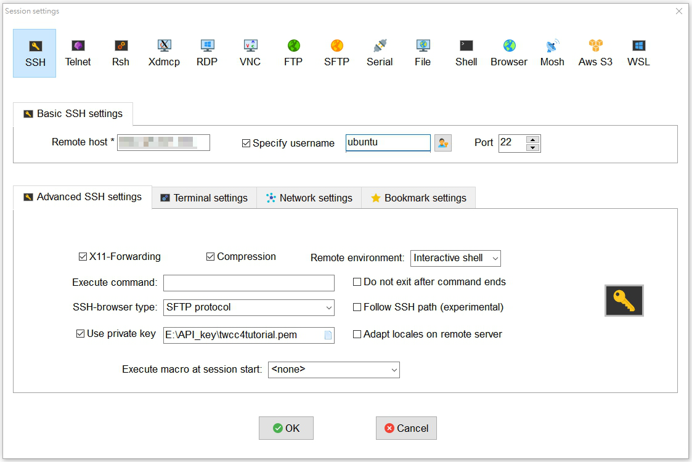

# ssh connect

<!-- TOC -->

- [ssh connect](#ssh-connect)
  - [金鑰檔方式](#金鑰檔方式)
  - [帳號密碼](#帳號密碼)
  - [END](#end)

<!-- /TOC -->

---

## 金鑰檔方式

因為ssh服務預設使用金鑰做登入，所以.pem/.ppk檔的登入方式，是沒問題的。  

- .ppk 可以用 PuTTY.exe 做連線。
- .pem 可以用 MobaXterm/cmd 做連線。

連線時的port為22。  
使用者帳號為 ubuntu系統為ubuntu / centos系統為centos / windows系統為administrator。

--

**PuTTY 登入:**

請先用 PuTTYgen 將.pem檔轉為.ppk檔。  
參考: [PuTTYgen 將 .pem 金鑰檔案轉為 .ppk 格式教學 - Office 指南](https://officeguide.cc/putty-convert-pem-to-ppk-tutorial/)  
將轉換好的.ppk檔案，放到 PuTTY.exe > Connection > SSH > Auth > Private key file for authentication。  
並在 PuTTY.exe > Session > Host Name (or IP address)，填入想連線的IP。  
設定好了之後，按下右下角的 Open，  
輸入使用者帳號名稱(比如:ubuntu系統即為ubuntu)，即可進入。

**MobaXterm 登入示意圖:**


---

## 帳號密碼

但是有些人不習慣使用金鑰的方式做登入，那要怎麼把 ssh 的設定做修改呢?  
首先要先建立帳號

```{bash}
sudo su  --切換到超級使用者
adduser <new_username>  --新增要用密碼登入的使用者名稱

  > 系統接下來就會指示你要輸入使用者名稱、密碼、fullname...等等。
  > 使用者名稱、密碼最重要，其他直接按 Enter 就可以了(會使用預設的)。
```

```{bash}
sudo vim /etc/sudoers  --修改文件

  > 找 「# User privilege specification」的區塊
  > root    ALL=(ALL:ALL) ALL  <--原本就有的。
  > <new_username> ALL=(ALL:ALL) ALL  <--新增這一行。
```

```{bash}
vim /etc/ssh/sshd_config  --修改 ssh 服務的設定。

  > 將 PasswordAuthentication no 改為 yes。  
  > PasswordAuthentication yes
```

```{bash}
service sshd restart  --重啟sshd服務。
```

設定完成後，就可以利用 cmd 做帳號密碼登入的連線了!!

```{bash}
ssh -V  --確認有無 ssh 服務
ssh new_username@hostip

  > 按照指示輸入密碼。
```

也可利用 PuTTY.exe 連線。

```{bash}
putty.exe -ssh new_username@hostip -pw password
或是
start putty.exe -ssh new_username@hostip -pw password
```

---

## END
